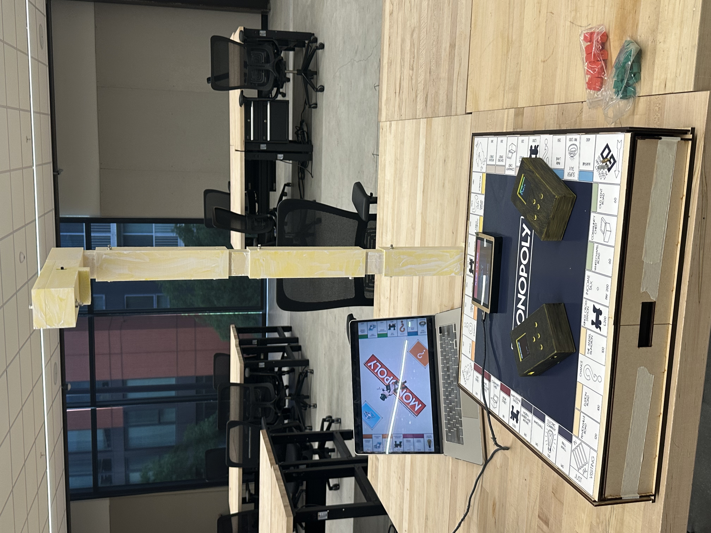
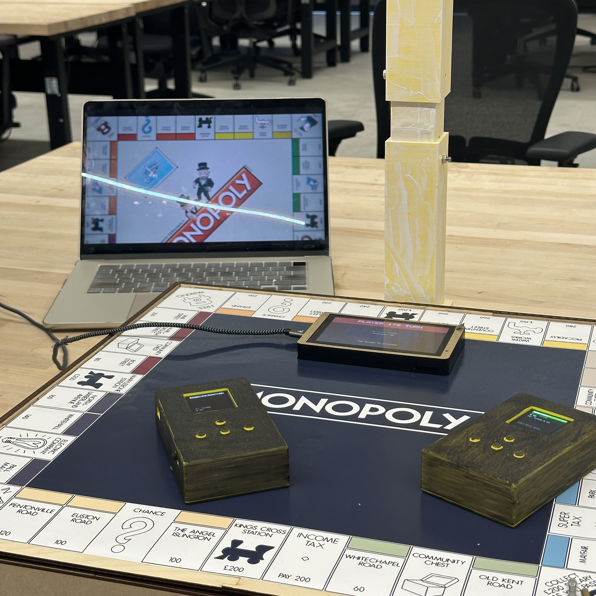

# Smart Monopoly

A smart Monopoly system that automatically tracks board state and enforces rules, so players can focus on strategy and fun.




## Demo Videos

| Scenario | Link |
|---|---|
| Vision detection — green house | [Watch](https://drive.google.com/file/d/1YYkAQqQGW3G5yaRUnQ6ajyW9RlyFcLrm/view?usp=drive_link) |
| Vision detection — red hotel | [Watch](https://drive.google.com/file/d/1fPO76GP8kFQUbU6NWimg8kV7IUoyudl7/view?usp=drive_link) |
| Auction | [Watch](https://drive.google.com/file/d/1G2KbDcnRxIF2fS2yyap2P3zmI8cTID51/view?usp=drive_link) |
| NFC payment | [Watch](https://drive.google.com/file/d/1PzwGUXprhIAtn__mJcu651hlFBT1dVyA/view?usp=drive_link) |

## System Overview

The system consists of three main components:

- **Vision subsystem** — Grove Vision AI V2 detects house/hotel placement on the board. An ESP32-C3 processes the raw coordinates into property-level data and transmits it to the central bank via ESP-NOW.
- **Central bank** — CrowPanel ESP32 5" manages all public game logic (dice rolls, chance/community cards, auctions, jail) and syncs state to both player devices via BLE. It also receives vision data and alerts players if houses are placed incorrectly.
- **Player devices (×2)** — Each device (XIAO ESP32-S3) has an OLED display, 4 buttons, and an NFC reader. Players use buttons to interact with the game and tap devices together for rent payments and auctions.

## Repository Structure

```
515_monopoly/
├── README.md
├── assets/
│   ├── full_view.jpg
│   └── details.jpg
├── software/
│   ├── README.md               # Code running instructions
│   ├── central_bank/           # CrowPanel ESP32 game logic & display
│   ├── player_card/            # XIAO ESP32-S3 player device firmware
│   ├── vision/                 # Grove Vision AI V2 + ESP32-C3 (ESP-NOW sender)
│   ├── central_display_test/   # Display UI testing
│   └── player_device_test/     # Player device testing
├── hardware/
│   ├── playbox+vision.f3z      # Fusion 360 enclosure & camera mount
│   ├── playbox_lasercut/       # SVG files for laser cutting
│   ├── player_card.f3z         # Fusion 360 player card enclosure
│   ├── player_card_pcb/        # PCB design files
│   ├── player_card_model/      # Player card 3D model files
│   └── vision_archi/           # Vision module hardware files
├── docs/
│   ├── milestone1.pdf
│   ├── milestone2.pdf
│   └── milestone3.pdf
└── test/                       # Early-stage hardware experiments (abandoned)
    ├── RFID test/
    ├── Hall Effect test/
    └── FSR test/
```

## Hardware

| Component | Role |
|---|---|
| Grove Vision AI V2 | House / hotel detection |
| ESP32-C3 | Coordinate processing & ESP-NOW transmission |
| CrowPanel ESP32 5" | Central bank — game logic & public display |
| XIAO ESP32-S3 (×2) | Player devices |
| OLED SSD1351 (×2) | Player display |
| NFC reader (×2) | Rent payment between players |

## Communication

| Link | Protocol |
|---|---|
| Grove Vision AI V2 → ESP32-C3 | UART |
| ESP32-C3 → CrowPanel | ESP-NOW |
| CrowPanel ↔ Player devices | BLE |
| Player device ↔ Player device | NFC |

## Team

- **Sienna** — All software (except vision model training)
- **Polly** — All hardware (enclosure, PCB, player card), vision model training & grid calibration

## Legacy Test Code

The `test/` folder contains early-stage hardware experiments (RFID, Hall Effect, FSR) that were explored during Milestone 1 but later abandoned in favour of the vision-based detection approach.
